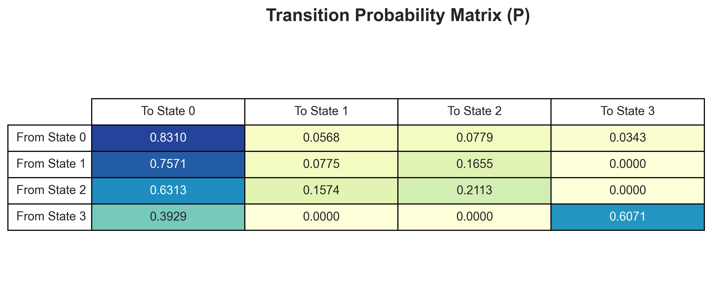
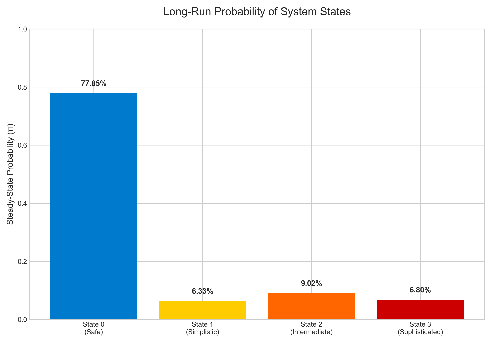
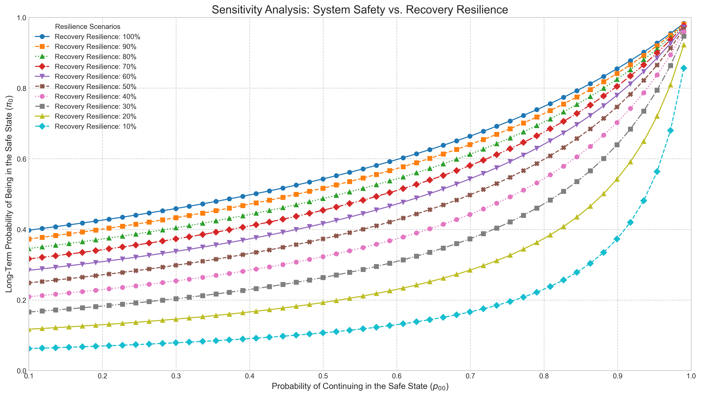

# Performance Analysis of UAV GPS Systems Under Spoofing Attacks using Discrete-Time Markov Chains

**Author:** Laís de Souza Ziegler

**Date:** June 2024

## 1. Project Overview

This repository contains the full analysis and academic paper for a final project for the **Systems Performance Analysis** course, part of the Master's in Computer Science program at the Pontificia Universidade Católica do Rio Grande do Sul (PUCRS).

The project's objective is to conduct a comprehensive performance and security analysis of a GPS system under spoofing conditions. Using a public dataset [1], a **Discrete-Time Markov Chain (DTMC)** is employed to model the sequence of transitions between a "Safe" operational state and three distinct "Attack" states. The goal is to quantitatively assess the system's resilience and vulnerabilities based on the observed event patterns and to explore its behavior under various hypothetical scenarios through sensitivity analysis.

The complete academic paper derived from this analysis, `artigo-ads.docx`, is included in this repository for further details.

## 2. Key Findings

The DTMC analysis of the observed data and the subsequent sensitivity analysis revealed several key insights into the system's behavior:

* **Resilient but Vulnerable:** The system is in a "Safe" state for the majority of the time (~78% of observed events). However, it is also frequently exposed to attacks, spending over 22% of its time in a compromised state.
* **Rapid Recovery:** The model shows the system is highly resilient. Once it leaves the "Safe" state, it returns in an average of just **1.28 steps**, suggesting a rapid recovery capability.
* **Distinct Attack Profiles:** The analysis uncovered two different threat profiles:
    * **Fleeting Attacks:** Lower-level spoofing attacks (Simplistic and Intermediate) are typically isolated events with a high probability of immediately returning to the "Safe" state.
    * **Persistent Attacks:** The "Sophisticated" attack is highly persistent, with a high probability (60.7%) of remaining in that compromised state from one step to the next.
* **Synergy of Stability and Resilience:** The sensitivity analysis demonstrated that long-term system safety depends on a synergy between its intrinsic stability (the probability of staying safe) and its recovery resilience (the ability to recover from attacks). High resilience is most critical for an unstable system, while high stability can compensate for poor recovery capabilities.

## 3. Methodology

The analysis follows a step-based approach using a Discrete-Time Markov Chain, which is well-suited for the event-based nature of the dataset. The core workflow is:
1.  **Data Cleaning:** A multi-step process was applied to the raw data to resolve duplicate timestamps and distill a single, unambiguous sequence of system states. The primary selection criterion was the Carrier-to-Noise Ratio (`CN0`).
2.  **P-Matrix Estimation:** The Transition Probability Matrix (P) was empirically estimated by counting the frequency of each state transition in the cleaned data.
3.  **Metrics Calculation:** Key performance indicators—including Steady-State Probabilities (π), System Utilization (U), Average Attack Severity (N), and Mean Recurrence Time (W)—were calculated from the P-matrix.
4.  **Sensitivity Analysis:** An iterative analysis was conducted to generate a family of curves showing how long-term system safety ($\pi_0$) is impacted by the interplay between intrinsic stability ($p_{00}$) and recovery resilience.

## 4. Dataset

This study utilizes a public dataset specifically designed for GPS spoofing detection research:
* **Title:** A DATASET for GPS Spoofing Detection on Unmanned Aerial System [1]
* **Description:** The dataset was collected using an 8-channel USRP-based GPS receiver in both static and moving scenarios, and includes data for three distinct, simulated spoofing attack types.
* **Format Used:** This analysis uses the simplified 2D feature map, where data from unlocked channels has been removed.

## 5. Visualizations

The key findings of this analysis are summarized in the following visualizations generated by the notebook:

## 6. How to Run the Analysis

### Prerequisites
The analysis was conducted in Python. The following libraries are required:
* `pandas`
* `numpy`
* `matplotlib`
* `networkx`

You can install them via pip: `pip install pandas numpy matplotlib networkx`

### Execution
1.  Ensure the data file `GPS_Data_Simplified_2D_Feature_Map.csv` is in the same directory.
2.  Open and run the cells sequentially in the `gps-spoofing-analysis.ipynb` Jupyter Notebook.

## 7. Repository Contents
* `gps-spoofing-analysis.ipynb`: The main Jupyter Notebook with the full analysis and visualization code.
* `paper-ads.pdf`: The final academic paper detailing the research.
* `GPS_Data_Simplified_2D_Feature_Map.csv`: The source data file.
* `README.md`: This file.
* Generated images (`resilience_graph.png`, `gps_pmatrix_table.png`, etc.).

---
*[1] Aissou, Ghilas (2022). A DATASET for GPS Spoofing Detection on Unmanned Aerial System, Mendeley Data, V3, doi: 10.17632/z7dj3yyzt8.3*